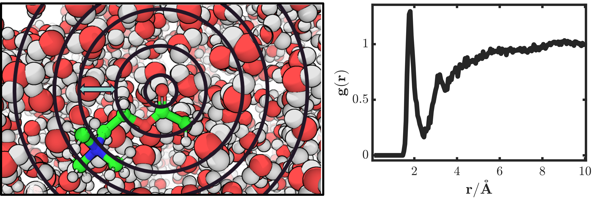
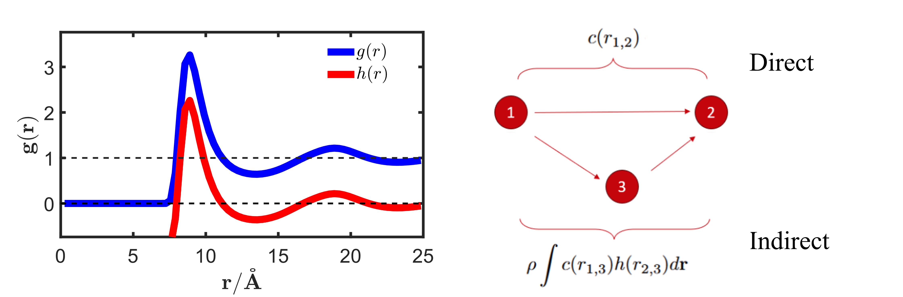

Background for Integral Equation Theory and 3DRISM 
==================================================

Correlation Functions in Liquid
-------------------------------
Unlike implicit solvent models, which describe the solution surrounding the solute as a continuum, or explicit models, which account for all solvent degrees of freedom by representing the solution on an all-atom basis, Integral Equation Theory61 (IET), including 3DRISM, considers solvent density distributions. These distributions are most often expressed in the form of the radial distribution function (RDF), which represents the probability of finding a particle at a given distance from the atom of interest relative to the bulk solution. In MD simulations, the RDF is obtained by summing all individual atomic sites surrounding a reference site within increasingly larger spherical shells, then dividing the result by the shell volume and the bulk density (see Figure 1). Hence, the RDF can be viewed as the factor that multiplies the bulk density to yield the local density.

   
   RDF of water hydrogen around acetylcholine carbonyl oxygen. Left: representative snapshot of the simulation showing the shell width dr (blue arrow). Right: Plot of water hydrogen density around the carbonyl oxygen.

To describe the correlation between particle densities, or how the density is impacted by the correlations between our given particle and all others, we define a radial distribution function g(r) and a total correlation function h(r):

:math:`N_{ab}\left(r\right)=\frac{1}{n_{frames}}\sum_{s=1}^{n_{frames}}\sum_{i=1}^{n_a}\sum_{j=1}^{n_b}\delta\left(r_{ij}^s-r\right)`

:math:`g_{ab}\left(r\right)=\frac{N_{ab}\left(r\right)}{\rho_{total}^bV}`

:math:`h_{ab}\left(r\right)=g_{ab}\left(r\right)-1`

The RISM Equation
-----------------
From the work of Ornstein and Zernike it was proposed to decompose this total correlation function into two parts: direct c(r) and indirect correlation.  Where the direct part represents the correlation (arbitrarily numbered) atom 1 has on atom 2, and the indirect part represents the correlation exerted on atom 2, by atom 3, given atom 3 correlation with atom 1 (see Figure 2).

   The RDF and the OZ equation. Right: Example of g(r) versus h(r) for a simple Lennard-Jones liquid at equilibrium (Kobb-Andersen misture at T = 1) Left: schematic depicting the components of the OZ equation, where direct c(r) considers correlation between atom 1 and atom 2, and indirect, which considers how atom 2 is influenced by atom 1 via atom 1’s correlation with neighboring particles.

This equation can be readily solved for simple LJ systems, but becomes increasingly difficult when considering non spherical molecules, as one must include molecular shape and orientation into the equation, resulting in a 6-dimensional problem with x, y, z position and :math:`\psi`, :math:`\theta`, :math:`\phi` orientation. To combat this, Chandler and Andersen proposed the reference-interaction-site-model (RISM) where the molecules in the system are approximated by the use of integral equations that rely only on the distance between sites. These ‘sites’ are the spherically symmetric atoms in a molecule and the correlations between them depend only on a 1-dimensional distance. The equation includes our previously defined, direct and indirect terms, but a third term is introduced: intramolecular correlation,:math: `\omega(r)` which represents the correlation between atoms in the same molecule. In RISM, both solute-solute and solvent-solvent correlations are defined as simple delta functions. :math:`(s_{ij}\left(r\right)=\delta\left(r-b_{ij}\right))`, where b is the bond length between atoms in the same molecule \delta is the Dirac delta function and the subscripts represent two given sites i, and j. Since considerations rely only on distance r RISM results in :math:`N_{sites}\times N_{sites}` equations:

:math:`h_{ab}\left(\mathbf{r}_{ab}\right)=\sum_{c,d}\iint{\omega_{ac}\left(r_{ac}\right)c_{cd}\left(\mathbf{r}_{cd}\right)\chi_{db}\left(\mathbf{r}_{db}\right)\rho_c^b\rho_d^bd\mathbf{r}_cd\mathbf{r}_d}`

where the solvent susceptibility function is a combination of intra :math:`(\omega_{ab})` and inter-molecular :math:`(h_{ab})` correlations:

:math:`\chi_{ab}\left(\mathbf{r}_{ab}\right)=\omega_{ab}\left(r_{ab}\right)+h_{ab}\left(\mathbf{r}_{ab}\right)`

:math:`\omega_{ab}\left(r_{ab}\right)=\delta_{ab}\delta\left(r_{ab}\right)+\delta\left(r_{ab}-b_{ab}\right)`

Where a and b are labels of two liquid sites. b_{ab} is the fixed distance between site a and b if these two sites appear in the same molecule. For homogenous liquids, :math:`h_{ab}\left(\mathbf{r}_{ab}\right)=h_{ab}\left(r_{ab}\right)`.
In particular, for the solute-solvent system where the solute is infinite dilute, the RISM equation for the solute-solvent correlation is written as the following form called the 3DRISM equation:

:math:`h_v\left(\mathbf{r}_{uv}\right)=\sum_{v^\prime}\iint{c_{v^\prime}\left(\mathbf{r}_{v^\prime}\right)\chi_{vv^\prime}\left(r_{vv^\prime}\right)\rho_{v^\prime}^bd\mathbf{r}_{v^\prime}}`

Here, v and :math:`v\prime` represent solvent sites, :math:`\rho_{v^\prime}^b`  is the bulk density of solvent site :math:`v\prime`, :math:`h_v\left(\mathbf{r}\right)=\rho_v\left(\mathbf{r}\right)/\rho_{v^b}-1` is called the total correlation function of solvent site v at grid location :math:`\mathbf{r}`, :math:`c_v(r)` is the direct correlation function. :math:`r_{vv^\prime}\ \ =\ |r_v\ -\ r_{v^\prime}|` is the distance between two solvent sites v and :math:`v\prime`, :math:`h_{vv^\prime}(r_{vv^\prime})` is the inter-solvent density distribution that computed from MD simulations or 1DRISM.

Closure Equations
-----------------

The 3DRISM equation involves two unknown quantities, the total and direct correlations, where an additional equation called the closure relation is needed to numerically solve the total and direct correlation functions. In general, the closure equation takes the following math form:

:math:`h_v\left(\mathbf{r}\right)=e^{-u_v\left(\mathbf{r}\right)/k_BT+h_v\left(\mathbf{r}\right)-c_v\left(\mathbf{r}\right)+B_v\left(\mathbf{r}\right)}-1`

Here :math:`u_v(r)` is the potential energy of solvent site v at :math:`\mathbf{r}` that generated by all solute sites, computed via a molecular forcefield. :math:`k_B` is the Boltzmann constant and T is the temperature. :math:`B_v(r)` is called the bridge diagram term, which includes all high order terms induced by many body effects involving more than four particles (one solute atom and three solvent grids). To solve the 3DRISM equation, the closure equation is applied to Eq. (5) in a self-consistent manner, until the error between the current iteration and the previous one is less than an arbitrary value – usually in the range of :math:`{10}^{-4}` to :math:`{10}^{-8}`.
In practice, the accurate calculation of :math:`B_v(\mathbf{r})` is not implementable and the true form is not known. Consequently, approximations are required for the closure equation. The simplest being the hyper-netted-chain (HNC) closure, which completely ignores :math:`B_v(\mathbf{r})`:

In practice, the HNC closure will lead to divergence of the 3DRISM calculations, especially for larger solutes. The partial series expansion (PSE-n) closure considers n orders of the polynomial expansion of the exponential function used in HNC.  

:math:`h_v\left(\mathbf{r}\right)=\left\{\begin{matrix}e^{-u_v\left(\mathbf{r}\right)/k_BT+h_v\left(\mathbf{r}\right)-c_v\left(\mathbf{r}\right)}-1&h_v\left(\mathbf{r}\right)\le 0\\\sum_{m=1}^{n}\frac{\left(-u_v\left(\mathbf{r}\right)/k_BT+h_v\left(\mathbf{r}\right)-c_v\left(\mathbf{r}\right)\right)^m}{m!}&h_v\left(\mathbf{r}\right)\geq 0\\\end{matrix}\right.`

At n=1, (PSE-1) the closure is referred to as the Kovalenko-Hirata (KH) closure67, 68. The HNC, PSE-n and KH closures are the more commonly used closures. With respect to biomolecules, KH, PSE-2 and PSE-3 are used more frequently.

